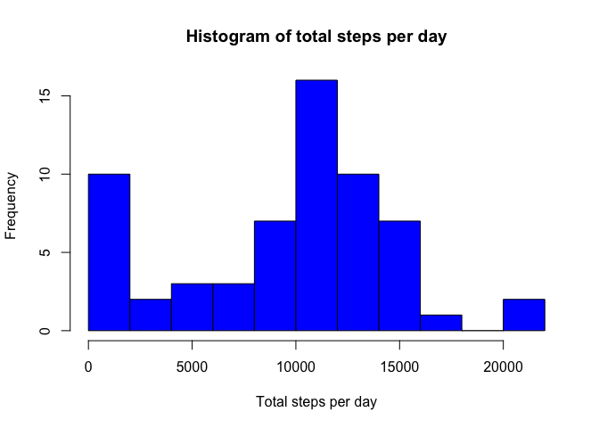
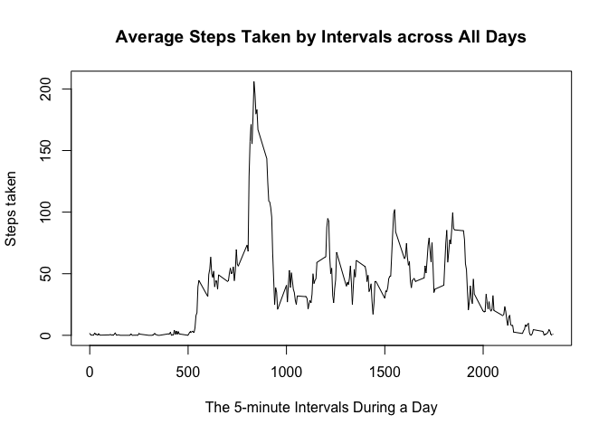
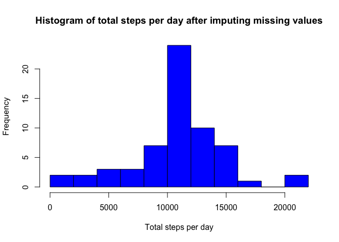
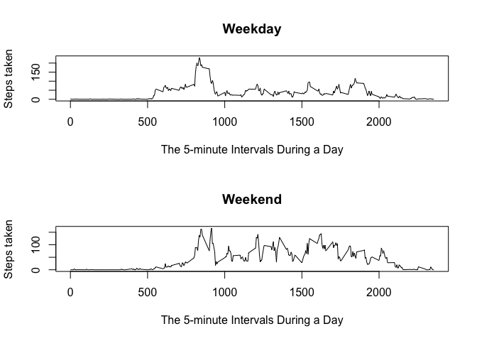

# Reproducible Research: Peer Assessment 1


## Loading and preprocessing the data
Set the working directory correctly and load the CSV file into a data frame.

```r
setwd("/Users/gengx/R/ReproducibleResearch_Asgnmt1")
df<-read.csv("activity.csv")
str(df)
```

```
## 'data.frame':	17568 obs. of  3 variables:
##  $ steps   : int  NA NA NA NA NA NA NA NA NA NA ...
##  $ date    : Factor w/ 61 levels "2012-10-01","2012-10-02",..: 1 1 1 1 1 1 1 1 1 1 ...
##  $ interval: int  0 5 10 15 20 25 30 35 40 45 ...
```
## What is mean total number of steps taken per day?
First, calculate the total number of steps taken each day.Remove the missing value in calculating the total numbers.

```r
day_steps<-tapply(df$steps,df$date,sum,na.rm=TRUE)
```

Second, make a historgram of it:

```r
hist(day_steps,10,col="blue",xlab="Total steps per day", main="Histogram of total steps per day")
```

<!-- -->

Finally, calcute the mean and median of the total number of steps taken per day:


```r
mean(day_steps)
```

```
## [1] 9354.23
```

```r
median(day_steps)
```

```
## [1] 10395
```


## What is the average daily activity pattern?
First calculate the average steps taken across all days for all intervals.

```r
interval_steps<-tapply(df$steps,df$interval,mean,na.rm=TRUE)
```

Then make a time series plot to show the average daily activity pattern across all days:

```r
plot(names(interval_steps),interval_steps,type="l",xlab="The 5-minute Intervals During a Day",ylab="Steps taken",main="Average Steps Taken by Intervals across All Days")
```

<!-- -->

Now let's find out which 5-minute interval contains the maximus steps on average:


```r
interval_steps[interval_steps==max(interval_steps)]
```

```
##      835 
## 206.1698
```

Looks like 8:35-8:40am has the most activities on average.

## Imputing missing values

Now let's take a look at the missing values. How many rows of the data has missing values?

```r
sum(!complete.cases(df)) 
```

```
## [1] 2304
```
For these missing values, we will replace them with the mean for the same 5-minute interval in the following steps:

First, subset the dataframe to get the rows with missing values.

```r
df_na<-df[!complete.cases(df),]
```

Then, replace the NA value with the mean value for that same interval:

```r
df_na$steps<-interval_steps[as.character(df_na$interval)]
```

Check to make sure the values were actually filled in:

```r
head(df_na)
```

```
##       steps       date interval
## 1 1.7169811 2012-10-01        0
## 2 0.3396226 2012-10-01        5
## 3 0.1320755 2012-10-01       10
## 4 0.1509434 2012-10-01       15
## 5 0.0754717 2012-10-01       20
## 6 2.0943396 2012-10-01       25
```

Finally, put the imputed rows back to the original dataset to form a new dataset, and check to make sure there is no missing values any more:

```r
df_complete<-df[complete.cases(df),]
df_new<-rbind(df_na,df_complete)
sum(!complete.cases(df_new))
```

```
## [1] 0
```

With the new dataset let's re-calculate the total steps taken each day, and the mean and median value of it:

```r
day_steps_new<-tapply(df_new$steps,df_new$date,sum)
hist(day_steps_new,10,col="blue",xlab="Total steps per day", main="Histogram of total steps per day after imputing missing values")
```

<!-- -->

```r
mean(day_steps_new)
```

```
## [1] 10766.19
```

```r
median(day_steps_new)
```

```
## [1] 10766.19
```

These values are different from the ones calculated previously before imputing the missing values. Both mean and median shifted to the right side of the axis.

## Are there differences in activity patterns between weekdays and weekends?

Let's first add a variable to the dataset to indicate whether a given day is a weekday or weekend day.


```r
df_new$day_type<- ifelse(weekdays(as.Date(df_new$date))=='Saturday' | weekdays(as.Date(df_new$date))=='Sunday',"weekend" , "weekday")
head(df_new)
```

```
##       steps       date interval day_type
## 1 1.7169811 2012-10-01        0  weekday
## 2 0.3396226 2012-10-01        5  weekday
## 3 0.1320755 2012-10-01       10  weekday
## 4 0.1509434 2012-10-01       15  weekday
## 5 0.0754717 2012-10-01       20  weekday
## 6 2.0943396 2012-10-01       25  weekday
```

Then we'd like to split the datasets into weekdays and weekends so that we can compare the activity pattern.

```r
df_new_weekday<-df_new[(df_new$day_type=="weekday"),]
df_new_weekend<-df_new[(df_new$day_type=="weekend"),]
```

Finally, let's calculate the interval mean across all days under each categories, and make a panel plot to compare the activity pattern differences:

```r
interval_steps_weekday<-tapply(df_new_weekday$steps,df_new_weekday$interval,mean)
interval_steps_weekend<-tapply(df_new_weekend$steps,df_new_weekend$interval,mean)
par(mfrow=c(2,1))
plot(names(interval_steps_weekday),interval_steps_weekday,type="l",xlab="The 5-minute Intervals During a Day",ylab="Steps taken",main="Weekday")
plot(names(interval_steps_weekend),interval_steps_weekend,type="l",xlab="The 5-minute Intervals During a Day",ylab="Steps taken",main="Weekend")
```

<!-- -->

We can tell that on weekends the active period starts a little later in the morning, but ends later as well in the eveing, and the overall activity level is also higher throughout the day on weekends, which conforms to our daily experiences.
